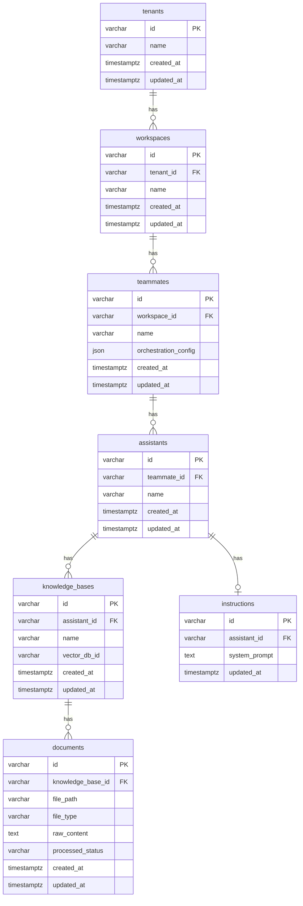

# Database Schema

## Overview

OYL uses a single PostgreSQL database with a shared-schema multi-tenancy model. Every entity is anchored to a `tenant_id`, cascading through the hierarchy:

```
Tenant → Workspace → Teammate → Assistant → KnowledgeBase → Document
                                          └→ Instruction
```

---

## Entity-Relationship Diagram

```
┌──────────────┐
│   tenants    │
│──────────────│
│ id (PK)      │◀──────────────────────────────────────────┐
│ name         │                                           │
│ created_at   │                                           │ (via cascade)
│ updated_at   │                                           │
└──────┬───────┘                                           │
       │ 1                                                 │
       │                                                   │
       │ *                                                 │
┌──────▼───────┐                                           │
│  workspaces  │                                           │
│──────────────│                                           │
│ id (PK)      │                                           │
│ tenant_id(FK)│───────────────────────────────────────────┘
│ name         │
│ created_at   │
│ updated_at   │
└──────┬───────┘
       │ 1
       │
       │ *
┌──────▼───────┐
│  teammates   │
│──────────────│
│ id (PK)      │
│ workspace_id │
│   (FK)       │
│ name         │
│ orchestration│
│  _config(JSON│
│ created_at   │
│ updated_at   │
└──────┬───────┘
       │ 1
       │
       │ *
┌──────▼──────────┐       ┌──────────────────┐
│   assistants    │       │   instructions   │
│─────────────────│       │──────────────────│
│ id (PK)         │◀──1──▶│ id (PK)          │
│ teammate_id (FK)│       │ assistant_id (FK)│
│ name            │       │  UNIQUE          │
│ created_at      │       │ system_prompt    │
│ updated_at      │       │ updated_at       │
└──────┬──────────┘       └──────────────────┘
       │ 1
       │
       │ *
┌──────▼──────────┐
│ knowledge_bases │
│─────────────────│
│ id (PK)         │
│ assistant_id(FK)│
│ name            │
│ vector_db_id    │
│ created_at      │
│ updated_at      │
└──────┬──────────┘
       │ 1
       │
       │ *
┌──────▼──────────┐
│   documents     │
│─────────────────│
│ id (PK)         │
│ knowledge_base  │
│  _id (FK)       │
│ file_path       │
│ file_type       │
│ raw_content     │
│ processed_status│
│ created_at      │
│ updated_at      │
└─────────────────┘
```

### Mermaid ERD (renders in GitHub)



---

## Table Descriptions

### `tenants`

The root entity for multi-tenancy. Every other entity traces back to a tenant through foreign keys.

| Column | Type | Constraints | Description |
|--------|------|-------------|-------------|
| `id` | `VARCHAR` | PK, default `uuid4()` | Unique tenant identifier (UUID string) |
| `name` | `VARCHAR(255)` | NOT NULL, UNIQUE | Human-readable tenant name |
| `created_at` | `TIMESTAMPTZ` | NOT NULL, default `now()` | Row creation timestamp |
| `updated_at` | `TIMESTAMPTZ` | NOT NULL, auto-updated | Last modification timestamp |

**SQLAlchemy model**: `app/models/tenant.py` → `Tenant`

---

### `workspaces`

Organisational units within a tenant (e.g., departments, projects).

| Column | Type | Constraints | Description |
|--------|------|-------------|-------------|
| `id` | `VARCHAR` | PK | UUID |
| `tenant_id` | `VARCHAR` | FK → `tenants.id` CASCADE DELETE | Owning tenant |
| `name` | `VARCHAR(255)` | NOT NULL | Workspace name |
| `created_at` | `TIMESTAMPTZ` | NOT NULL | Created timestamp |
| `updated_at` | `TIMESTAMPTZ` | NOT NULL | Updated timestamp |

**SQLAlchemy model**: `app/models/workspace.py` → `Workspace`

---

### `teammates`

AI agents that orchestrate one or more assistants. Each teammate belongs to a workspace.

| Column | Type | Constraints | Description |
|--------|------|-------------|-------------|
| `id` | `VARCHAR` | PK | UUID |
| `workspace_id` | `VARCHAR` | FK → `workspaces.id` CASCADE DELETE | Owning workspace |
| `name` | `VARCHAR(255)` | NOT NULL | Teammate name |
| `orchestration_config` | `JSON` | Nullable | JSON blob: assistant routing rules, model preferences |
| `created_at` | `TIMESTAMPTZ` | NOT NULL | Created timestamp |
| `updated_at` | `TIMESTAMPTZ` | NOT NULL | Updated timestamp |

**Example `orchestration_config`**:
```json
{
  "strategy": "round_robin",
  "assistants": ["asst-uuid-1", "asst-uuid-2"],
  "fallback_assistant": "asst-uuid-1"
}
```

**SQLAlchemy model**: `app/models/teammate.py` → `Teammate`

---

### `assistants`

An AI model configuration owned by a teammate. Has exactly one instruction (system prompt) and one or more knowledge bases.

| Column | Type | Constraints | Description |
|--------|------|-------------|-------------|
| `id` | `VARCHAR` | PK | UUID |
| `teammate_id` | `VARCHAR` | FK → `teammates.id` CASCADE DELETE | Owning teammate |
| `name` | `VARCHAR(255)` | NOT NULL | Assistant name |
| `created_at` | `TIMESTAMPTZ` | NOT NULL | Created timestamp |
| `updated_at` | `TIMESTAMPTZ` | NOT NULL | Updated timestamp |

**SQLAlchemy model**: `app/models/assistant.py` → `Assistant`

---

### `knowledge_bases`

A collection of documents for a specific assistant. Each knowledge base maps to a ChromaDB collection.

| Column | Type | Constraints | Description |
|--------|------|-------------|-------------|
| `id` | `VARCHAR` | PK | UUID |
| `assistant_id` | `VARCHAR` | FK → `assistants.id` CASCADE DELETE | Owning assistant |
| `name` | `VARCHAR(255)` | NOT NULL | Collection name |
| `vector_db_id` | `VARCHAR(255)` | Nullable | ChromaDB collection identifier |
| `created_at` | `TIMESTAMPTZ` | NOT NULL | Created timestamp |
| `updated_at` | `TIMESTAMPTZ` | NOT NULL | Updated timestamp |

**SQLAlchemy model**: `app/models/knowledge.py` → `KnowledgeBase`

---

### `documents`

Individual uploaded files stored within a knowledge base.

| Column | Type | Constraints | Description |
|--------|------|-------------|-------------|
| `id` | `VARCHAR` | PK | UUID |
| `knowledge_base_id` | `VARCHAR` | FK → `knowledge_bases.id` CASCADE DELETE | Owning knowledge base |
| `file_path` | `VARCHAR(1024)` | NOT NULL | Filesystem path to uploaded file |
| `file_type` | `VARCHAR(64)` | Nullable | MIME type (e.g., `application/pdf`) |
| `raw_content` | `TEXT` | Nullable | Extracted text (OCR or plain-text) |
| `processed_status` | `VARCHAR(64)` | NOT NULL, default `'pending'` | `pending` \| `done` \| `error` |
| `created_at` | `TIMESTAMPTZ` | NOT NULL | Created timestamp |
| `updated_at` | `TIMESTAMPTZ` | NOT NULL | Updated timestamp |

**SQLAlchemy model**: `app/models/knowledge.py` → `Document`

---

### `instructions`

The system prompt for an assistant. One-to-one with `assistants` (enforced by UNIQUE constraint on `assistant_id`).

| Column | Type | Constraints | Description |
|--------|------|-------------|-------------|
| `id` | `VARCHAR` | PK | UUID |
| `assistant_id` | `VARCHAR` | FK → `assistants.id` CASCADE DELETE, UNIQUE | Owning assistant (1-to-1) |
| `system_prompt` | `TEXT` | NOT NULL | The system prompt sent to the LLM |
| `updated_at` | `TIMESTAMPTZ` | NOT NULL, auto-updated | Last modification timestamp |

**SQLAlchemy model**: `app/models/instruction.py` → `Instruction`

---

## Relationships Summary

| Parent | Child | Cardinality | FK Column | Cascade |
|--------|-------|-------------|-----------|---------|
| `tenants` | `workspaces` | 1 : many | `workspaces.tenant_id` | DELETE |
| `workspaces` | `teammates` | 1 : many | `teammates.workspace_id` | DELETE |
| `teammates` | `assistants` | 1 : many | `assistants.teammate_id` | DELETE |
| `assistants` | `knowledge_bases` | 1 : many | `knowledge_bases.assistant_id` | DELETE |
| `assistants` | `instructions` | 1 : 0-1 | `instructions.assistant_id` | DELETE |
| `knowledge_bases` | `documents` | 1 : many | `documents.knowledge_base_id` | DELETE |

---

## Indexing Strategy

The following indexes are recommended beyond the primary keys:

```sql
-- Fast workspace lookup by tenant
CREATE INDEX idx_workspaces_tenant_id ON workspaces (tenant_id);

-- Fast teammate lookup by workspace
CREATE INDEX idx_teammates_workspace_id ON teammates (workspace_id);

-- Fast assistant lookup by teammate
CREATE INDEX idx_assistants_teammate_id ON assistants (teammate_id);

-- Fast knowledge base lookup by assistant
CREATE INDEX idx_knowledge_bases_assistant_id ON knowledge_bases (assistant_id);

-- Fast document lookup by knowledge base + status (for processing jobs)
CREATE INDEX idx_documents_kb_status ON documents (knowledge_base_id, processed_status);

-- Instruction lookup by assistant (already has UNIQUE index via constraint)
-- No additional index needed for instructions.assistant_id
```

---

## Row-Level Security Policies (Future Enhancement)

When PostgreSQL RLS is enabled, the application sets a session variable at the start of each request:

```sql
-- Enable RLS
ALTER TABLE workspaces ENABLE ROW LEVEL SECURITY;
ALTER TABLE teammates  ENABLE ROW LEVEL SECURITY;
ALTER TABLE assistants ENABLE ROW LEVEL SECURITY;
ALTER TABLE knowledge_bases ENABLE ROW LEVEL SECURITY;
ALTER TABLE documents   ENABLE ROW LEVEL SECURITY;
ALTER TABLE instructions ENABLE ROW LEVEL SECURITY;

-- Policies (example for workspaces)
CREATE POLICY tenant_isolation_workspaces ON workspaces
    FOR ALL
    USING (tenant_id = current_setting('app.current_tenant_id', true));

-- Application sets session variable per request
SET LOCAL app.current_tenant_id = '<tenant-uuid>';
```

This provides a database-level safety net in addition to the application-layer tenant scoping already in place.

---

## Migration Strategy

Database migrations are managed with **Alembic** (included in `requirements.txt`):

```bash
# Initialise Alembic (first time only)
alembic init alembic

# Generate a migration from model changes
alembic revision --autogenerate -m "add indexes"

# Apply all pending migrations
alembic upgrade head

# Roll back one migration
alembic downgrade -1
```
